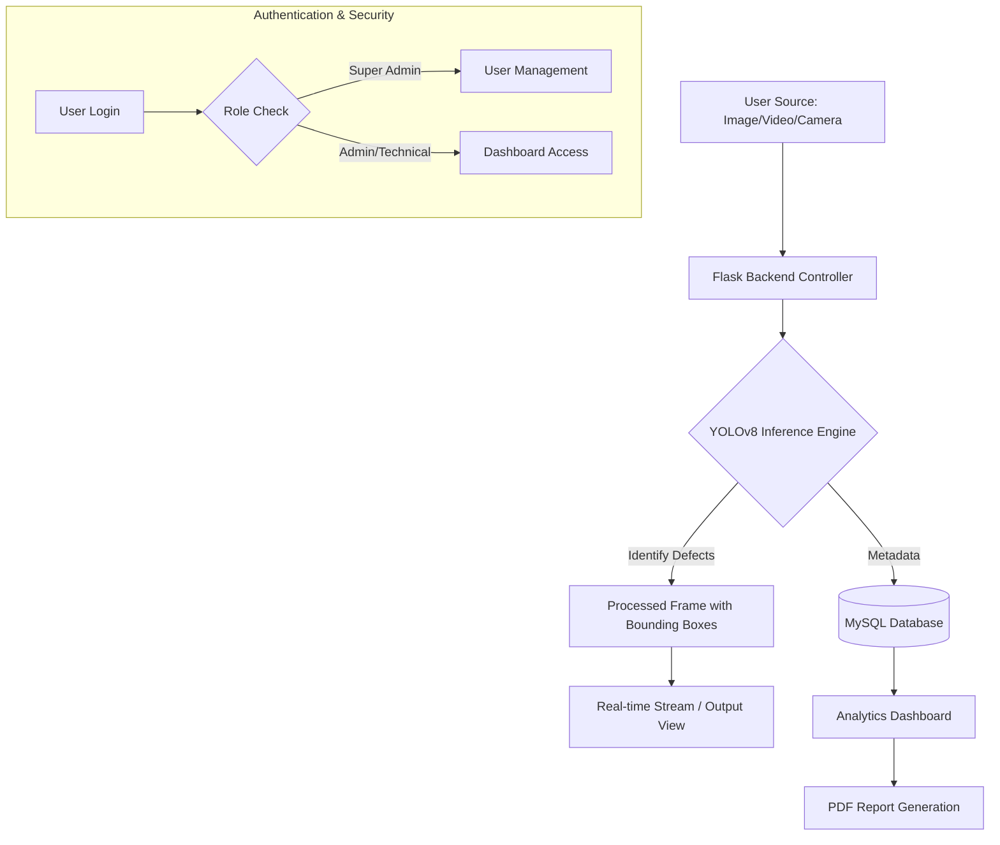

# SensSystem: Advanced Cable Defect Detection


## Project Overview
**SensSystem** is a state-of-the-art, web-based AI solution designed for real-time defect detection in cables. Leveraging computer vision and deep learning, the system identifies manufacturing flaws, wear, and structural anomalies with high precision. It provides a comprehensive dashboard for monitoring live feeds, processing uploaded media, and analyzing historical detection data.

---

##  Key Features
- **Real-time Detection**: Live camera streaming (webcam or external IP cameras) with sub-second inference.
- **Multi-Media Support**: Process static images and pre-recorded videos for defect analysis.
- **Smart Analytics**: Interactive dashboard with defect distribution charts and trend analysis using Chart.js.
- **Automated Capture**: Intelligent logic to automatically save and log frames when defects are detected.
- **Role-Based Access**: Secure user management with Super Admin, Admin, and Technical user roles.
- **Comprehensive Reporting**: Export detection results and analytics into professional PDF reports.
- **Database Persistence**: Robust storage of every detection event, including bounding boxes and confidence scores.

---

##  Technology Stack

### Backend
- **Framework**: [Flask](https://flask.palletsprojects.com/) (Python)
- **Database ORM**: [SQLAlchemy](https://www.sqlalchemy.org/)
- **Image Processing**: [OpenCV](https://opencv.org/) & [Pillow](https://python-pillow.org/)
- **Report Generation**: [fpdf2](https://github.com/fpdf2/fpdf2)

### AI/ML
- **Model**: [YOLOv8](https://docs.ultralytics.com/) (You Only Look Once) by Ultralytics
- **Inference**: Real-time bounding box prediction and classification.

### Frontend
- **Structure**: HTML5 & Jinja2 Templates
- **Styling**: Vanilla CSS3 (Custom Glassmorphism Design)
- **Logic**: Vanilla JavaScript (ES6+)
- **Visualization**: [Chart.js](https://www.chartjs.org/)

### Database
- **Engine**: MySQL

---

##  Project Flow



---

##  Installation & Setup

1. **Clone the Repository**:
   ```bash
   git clone <repository-url>
   cd project
   ```

2. **Install Dependencies**:
   ```bash
   pip install -r requirements.txt
   ```

3. **Database Configuration**:
   - Create a MySQL database (e.g., `sens_system_db`).
   - Configure your credentials in a `.env` file:
     ```env
     DB_HOST=localhost
     DB_PORT=3306
     DB_USER=root
     DB_PASSWORD=your_password
     DB_NAME=sens_system_db
     ```

4. **Initialize Database**:
   ```bash
   python init_db.py
   ```

5. **Run the Application**:
   ```bash
   python app.py
   ```
   Access the dashboard at `http://127.0.0.1:5000`.

---

## 📸 Usage
1. **Login**: Use your credentials to access the main dashboard.
2. **Detection Mode**:
   - **Live Camera**: Select a camera source and click "Start Camera".
   - **File Upload**: Drag and drop images or videos into the upload zone.
3. **Analytics**: Visit the Analysis page to view historical data and download summary reports.
4. **Settings**: Adjust the confidence threshold and FPS settings in real-time to optimize detection performance.

---

## 📁 Repository Structure
- `app.py`: Main Flask application server.
- `models.py`: Database schema definitions.
- `database.py`: DB connection and session management.
- `static/`: Frontend assets (CSS, JS, Icons).
- `templates/`: HTML templates for different views.
- `results/`: Storage for processed media with detections.
- `runs/`: YOLO training and prediction logs.

---

