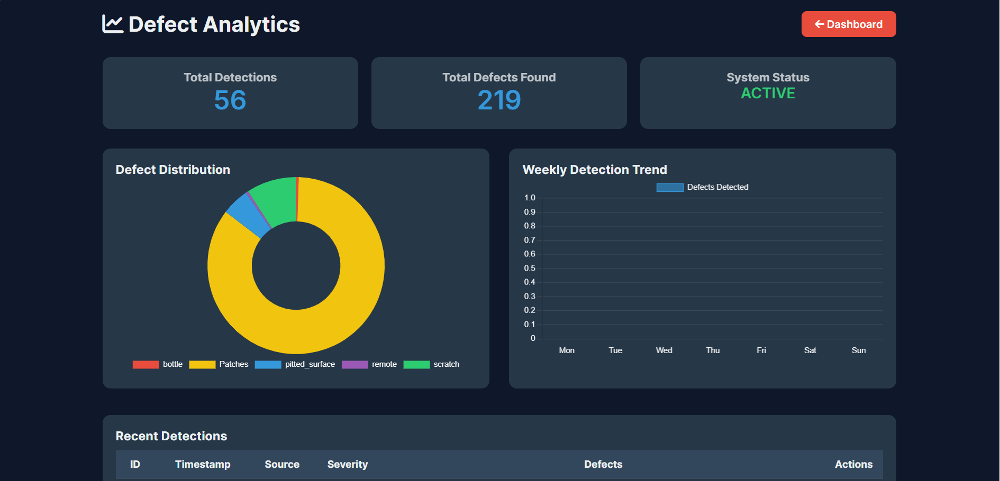
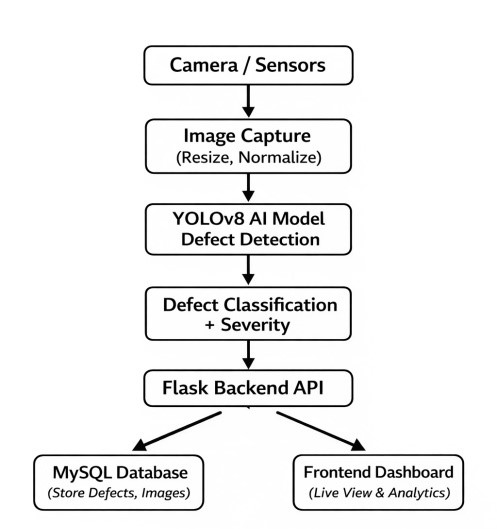

# 🚀 SensSystem: Multi-Sensor AI Vision System for Real-Time Cable Defect Detection

---

## 📌 Project Overview

**SensSystem** is an AI-powered industrial inspection platform designed for **real-time cable defect detection** in high-speed manufacturing environments.

The system leverages **computer vision, deep learning (YOLOv8), and multi-sensor integration (2D, 3D, IR)** to detect surface and subsurface defects with high accuracy.

It replaces manual inspection with a **fully automated Industry 4.0 solution** that enhances quality control, reduces human error, and improves production efficiency.

---

## 🧠 Core Idea

SensSystem is not just a detection tool — it is a **complete intelligent inspection ecosystem** that:

- Detects defects in real-time
- Tracks and logs inspection data
- Provides analytics and reports
- Supports continuous AI model improvement
- Integrates seamlessly with industrial workflows

---

## ⚙️ Key Features

- **Real-Time Detection**  
  Live camera streaming with sub-second AI inference.

- **Multi-Media Support**  
  Analyze images and videos for defect detection.

- **Smart Analytics Dashboard**  
  Visual insights into defect trends using charts.

- **Automated Capture System**  
  Automatically saves frames when defects are detected.

- **Role-Based Access Control**  
  Secure system with multiple user roles:
  - Super Admin
  - Admin
  - Technical User

- **PDF Reporting System**  
  Generate professional inspection reports.

- **Database Storage**  
  Store all detection results including:
  - Bounding boxes
  - Confidence scores
  - Images and metadata

---

## 🏭 System Architecture

### 1. Sensor Layer
- 2D Cameras
- 3D Depth Sensors
- IR Thermal Sensors

### 2. AI Processing Layer
- YOLOv8 Object Detection
- Real-time inference
- Multi-sensor data fusion

### 3. Backend Layer
- Flask API
- Image processing pipeline
- Database management

### 4. Frontend Layer
- Dashboard UI
- Analytics visualization
- Monitoring tools

---

## 🧰 Technology Stack

### Backend
- Flask (Python)
- SQLAlchemy
- OpenCV & Pillow
- FPDF (PDF reports)

### AI / Machine Learning
- YOLOv8 (Ultralytics)
- PyTorch

### Frontend
- HTML5 & Jinja2
- CSS3 (Glassmorphism Design)
- JavaScript (ES6+)
- Chart.js

### Database
- MySQL

---

## 🔁 Project Workflow

1. Cable passes through inspection system  
2. Sensors capture real-time data  
3. AI model processes frames  
4. Defects are detected and classified  
5. Results are displayed on dashboard  
6. Data is stored in database  
7. Reports and analytics are generated  

---

## 🧪 AI Capabilities

- Defect detection (scratches, deformation, surface damage)
- Severity classification (Low / Medium / High)
- Real-time processing
- Continuous improvement using new data

